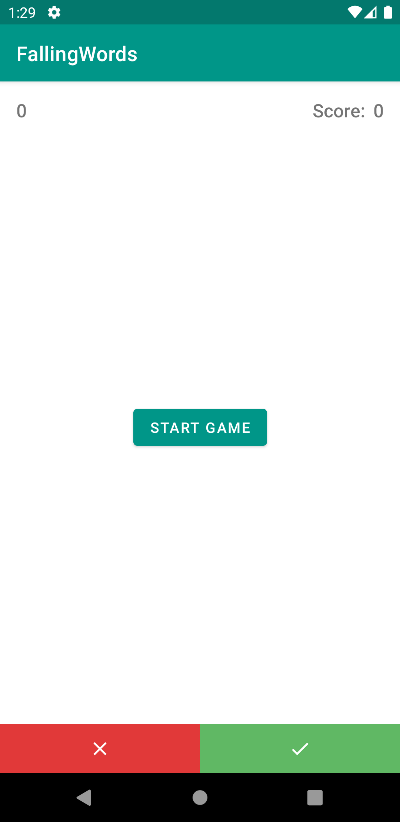
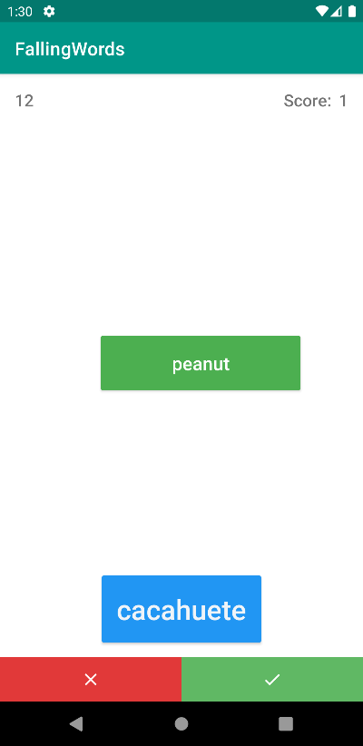
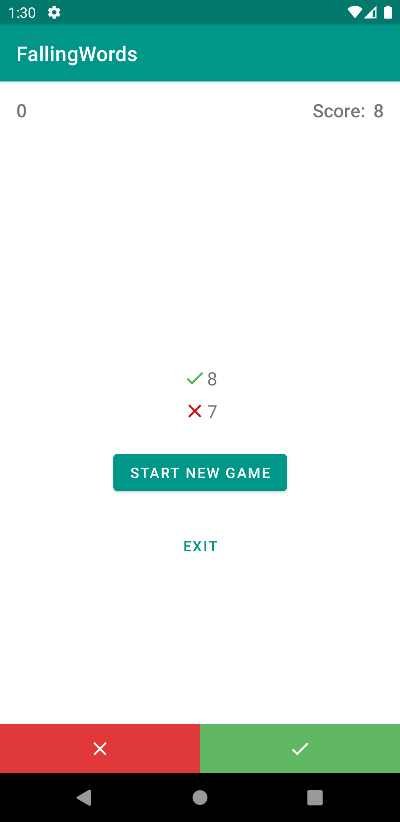

# ALittleGame

Falling words mini game 

**Baisc rules**  
The game will stop after showing 15 words in the screen, your goals is to get as many correct translations as possible

## Questions about the development
* how much time was invested (within the given limit)
  - A: 6 hrs, read some documentation about AnimatorObject and animations
* how was the time distributed (concept, model layer, view(s), game mechanics)
  - Concept: 30 min
  - Model layer: 20~35 some refactoring was needed after realizing some performance improvements as well as logic
  - Views: 1 hr. after some research some approaches were easier than others
  - Game mecanichs : 2hrs reding documentation was my passion during this time
* Decisions made to solve certain aspects of the game
  - Try to split game logic from the UI to allow further work in the future
* Decisions made because of restricted time
  - Even tho the game was pretty straight forward testing was the last thing to integrate, but once it got integrated some improvements were made
* what would be the first thing to improve or add if there had been more time
  - UI, I would have explore more the Animator API given that has a lot of great things also constraint layout, but a lot of them might impact in performance.
  - Game logic, maybe integrate other game styles or options.

### Screens 

  

    
  

  

  

  

  

